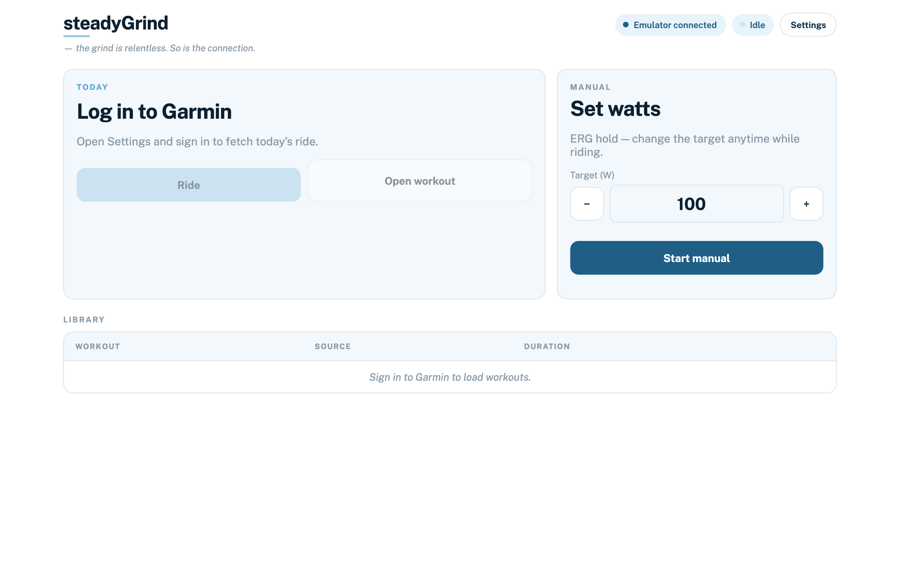
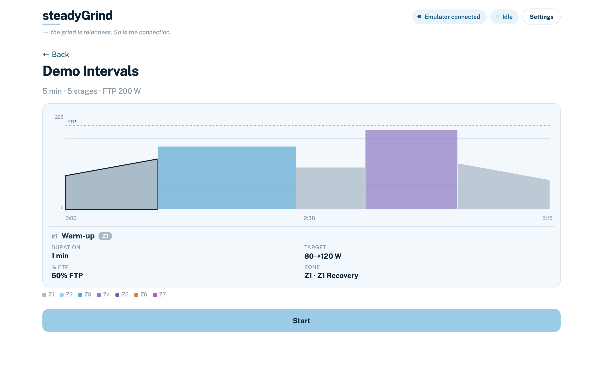
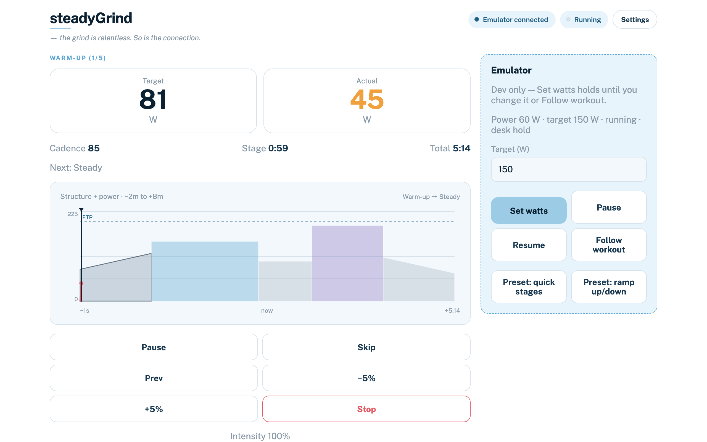
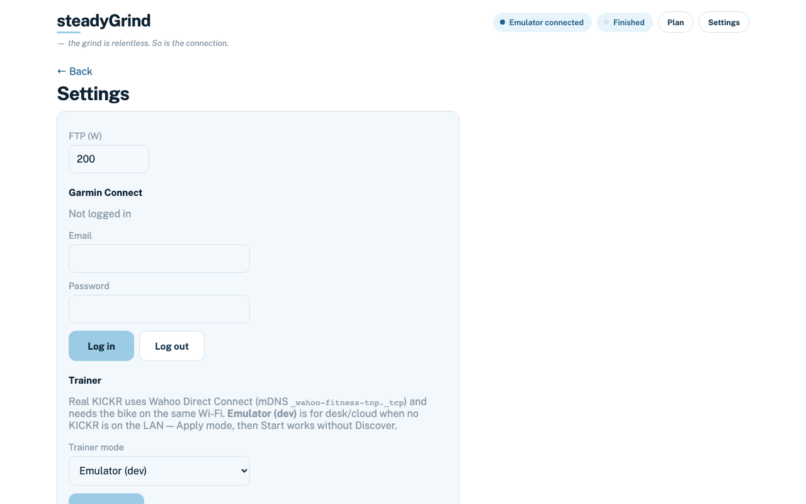
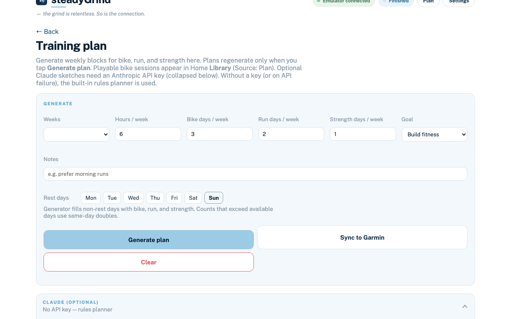
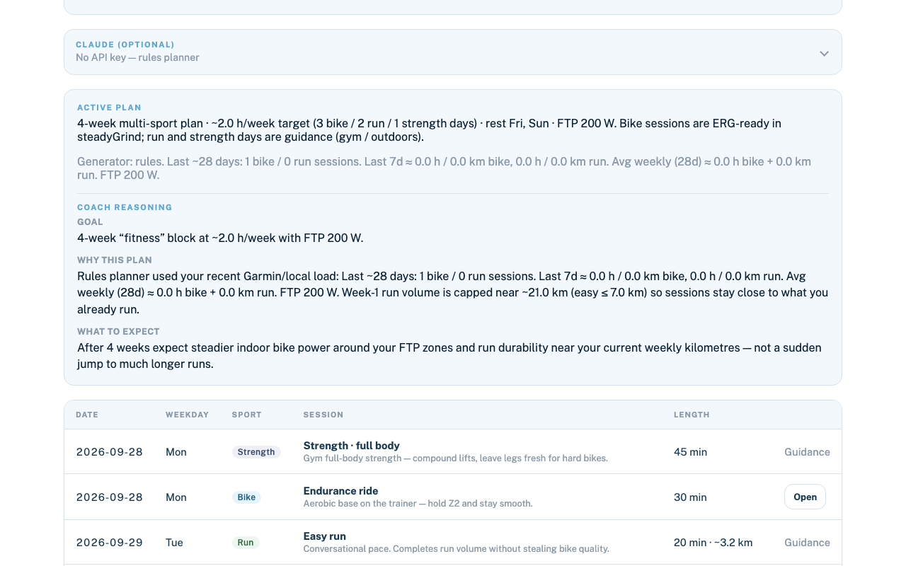

# steadyGrind

Self-hosted app that runs Garmin Connect workouts on a Wahoo KICKR v6 over Wi-Fi.
Same codebase on macOS and Raspberry Pi (Debian 13 / trixie).

See [specification/SPEC.md](specification/SPEC.md) for the full software spec (kept current with shipped behaviour).

## What's new (v1.1.0)

- **Plan 1.1.** Rest-day chips and optional strength sessions join bike+run weeks. Generate only when you tap **Generate plan** (no post-ride auto-replan).
- **Garmin-load sizing.** Claude and the rules planner use recent bike+run hours and km so run distances stay near your mileage, with on-host volume caps.
- **Coach reasoning.** After Generate, see goal / why / what to expect from the active plan.
- **LLM sketches (optional).** Anthropic Claude when you set an API key on Plan; rules fallback otherwise. Bike days are ERG-playable; run and strength are guidance; optional Sync to Garmin for bike/run.
- Keys never leave your machine via settings responses.

Full notes: [CHANGELOG](CHANGELOG.md) · [What's New](dist/1.1.0/WHAT_IS_NEW.md)

## Screenshots

Stills are 1280×800 (half the previous retina size).

Home — today's workout, Manual ERG, and library:



Workout preview — zone-coloured power profile:



Ride — structure + power overlay (−2m…+8m):



Settings — Garmin, trainer mode, Autoconnect:



Plan — weeks / hours / bike·run·strength days, rest chips, optional Claude:



Plan active — coach reasoning and multi-sport calendar:



Refresh stills (Emulator, no KICKR needed):

```bash
uv run python .cursor/skills/readme-screenshots/scripts/capture_readme_screenshots.py
```

## Phase A – run on macOS (dev)

```bash
# Requires Python 3.11+ (uv installs one if needed)
curl -LsSf https://astral.sh/uv/install.sh | sh   # once
source ~/.local/bin/env

cd HomeWlanTrainer
uv sync
./deploy/macos/run.sh
```

Open **http://localhost:8080** on the Mac, or **http://\<mac-name\>.local:8080** from a phone on the same LAN.

Allow **Local Network** access when macOS prompts (needed for KICKR mDNS discovery).

### Trainer emulator (desk development)

To exercise the app without a physical KICKR:

1. Open **Settings**.
2. Set **Trainer mode** to **Emulator (dev)** → **Apply mode**.
3. Use the Emulator panel: Set watts, Pause/Resume, or run a short preset (`quick_stages`, `ramp_up_down`).
4. Start **Manual** or a Garmin workout as usual — live power comes from the emulator.

Or via env (overrides a prior Real KICKR session saved in Settings for this process):

```bash
KICKR_TRAINER_MODE=simulated ./deploy/macos/run.sh
```

(`KICKR_ALLOW_SIMULATED=true` is implied when the mode is `simulated`; set `KICKR_ALLOW_SIMULATED=false` to force Real KICKR.)

Leave mode on **Real KICKR** for normal riding. Emulator APIs return 404 when DirCon is active.

## Share with a friend (macOS DMG installer)

**Download the latest DMG** (Apple silicon, v1.1.0):

```bash
curl -fL -o steadyGrind-1.1.0-macos.dmg \
  https://github.com/attilameget/HomeWlanTrainer/releases/download/v1.1.0/steadyGrind-1.1.0-macos.dmg
```

Also in the repo: [`dist/1.1.0/`](dist/1.1.0/) ([DMG](https://github.com/attilameget/HomeWlanTrainer/raw/cursor/plan-1.1-refine/dist/1.1.0/steadyGrind-1.1.0-macos.dmg)).

Rebuild locally (output goes to `dist/<version>/`; runs unit + e2e tests first):

```bash
./deploy/macos/build_dmg.sh
```


**On your friend's Mac**

1. Open the DMG and drag **steadyGrind** to Applications.
2. First launch: right-click → **Open** (unsigned / Gatekeeper).
3. Safari opens `http://127.0.0.1:8080`. Same Wi‑Fi as the KICKR; allow Local Network if asked. Allow Bluetooth to connect a heart-rate strap.
4. From a phone: use the LAN URL shown in the steadyGrind dialog (or `http://<mac-name>.local:8080`).
5. Settings → Garmin Connect to fetch today's bike workout.
6. Click **Quit** in the steadyGrind dialog when done.

Server log: `~/Library/Logs/steadyGrind/server.log`.

App-only build (no DMG): `./deploy/macos/build_app.sh` → `dist/steadyGrind.app`.

## Tests

Unit / API:

```bash
uv run pytest
```

UI end-to-end (Emulator; not part of the shipped app — see [`e2e/README.md`](e2e/README.md)):

```bash
uv sync --group dev
uv run playwright install chromium
uv run pytest e2e -q
```

## Phase B – Raspberry Pi (Debian 13 / trixie)

Native install on the Pi (not a cross-build from the Mac). Creates a venv under `/opt/kickr-pi` and a `systemd` unit that starts on boot.

Published wheel for this release: [`dist/1.1.0/kickr_pi-1.1.0-py3-none-any.whl`](dist/1.1.0/kickr_pi-1.1.0-py3-none-any.whl) · [PI_INSTALL.md](dist/1.1.0/PI_INSTALL.md)

```bash
# On the Pi (Debian 13 / Raspberry Pi OS), over SSH:
curl -fsSL https://github.com/attilameget/HomeWlanTrainer/archive/refs/heads/main.tar.gz \
  | tar -xz
cd HomeWlanTrainer-cursor-add-kickr-spec
sudo ./deploy/raspberrypi/install.sh
```

Or with git:

```bash
git clone -b main https://github.com/attilameget/HomeWlanTrainer.git
cd HomeWlanTrainer
sudo ./deploy/raspberrypi/install.sh
```

Build the wheel on a Mac/Linux host (optional, for Release assets / pip upgrade):

```bash
./deploy/raspberrypi/build_wheel.sh
```

Then open **http://kickr-pi.local:8080** on your phone (same LAN).

Details, `--port 80`, update/uninstall: [deploy/raspberrypi/README.md](deploy/raspberrypi/README.md).

### Claude (optional plan sketches)

On the **Plan** page, paste an Anthropic API key (from [console.anthropic.com](https://console.anthropic.com/)). Generate then prefers Claude for the week sketch; ERG stages stay on-host. Leave the key empty (or on API failure) and the built-in rules planner is used. You can also set `KICKR_ANTHROPIC_API_KEY` / `KICKR_ANTHROPIC_MODEL` in the environment.

The key is stored only on the host (Settings / SQLite or env). Do **not** commit `.env` files or real keys — this repository is public.
