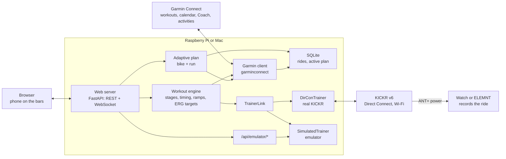
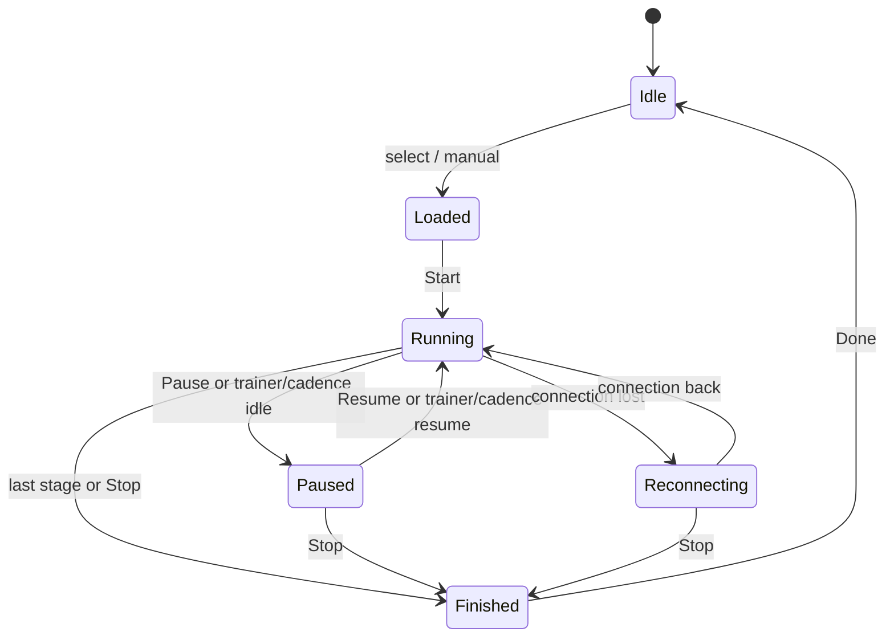

# steadyGrind – Software Specification

Version: 2026-10-04 · Author: Attila


> Spec for Cursor. Build in the milestone order of section 12. Target platforms: Raspberry Pi and macOS, one codebase. Keep this document current whenever behaviour ships. Product name: **steadyGrind**.

## 1. Purpose and scope

**steadyGrind** is a self-hosted app on a Raspberry Pi or a Mac that runs Garmin Connect workouts on a Wahoo KICKR v6 over Wi-Fi, with no subscription software. The rider picks a workout (or today's scheduled one) in a browser, starts it, and follows each stage live. A **Trainer Emulator** supports desk development without a physical bike.

**Goals**

- List workouts from the rider's Garmin Connect library and the workout scheduled for today (including Garmin Coach adaptive bike sessions).
- Run a selected workout in ERG mode on the KICKR v6 over Wi-Fi (Wahoo Direct Connect), or in **Manual ERG** with a rider-chosen watt target.
- Show the current stage, target vs. actual power, cadence, heart rate on a Mac, and time remaining in a web UI usable from a phone on the handlebars.
- Keep the Garmin watch or ELEMNT as the recording device, so training load and history stay in Garmin Connect.
- Generate an **on-host adaptive multi-sport training plan** from FTP, local saved rides, and Garmin bike + run history; bike days are ERG-playable; run days are guidance (outdoors/treadmill) and can sync to the Garmin calendar.
- Allow developers to exercise the full app with the Emulator when no KICKR is available.

**Non-goals (v1)**

- No virtual worlds, maps or video.
- No multi-user support; one rider, one trainer.
- No free-form workout editor; workouts come from Garmin Connect or from the adaptive plan generator (structured templates, not a stage designer).
- No upload of completed activities to Garmin (the watch records the ride). Plan sync may create/schedule **future** workouts on Garmin.
- No third-party cloud LLM APIs unless the rider pastes an **Anthropic API key**. Optional **Claude** may sketch the week; ERG stages still materialize on-host. Rules generator is the fallback.
- Emulator is a **dev** Settings mode, not a product feature for end riders.
- The KICKR does not execute run sessions; run days are never started as ERG rides.

## 2. User stories and main flow

The core flow takes four taps from opening the page to riding: open, pick, start, ride.

**User stories**

- As a rider, I open the web UI on my phone and see today's scheduled Garmin workout at the top, so I can start it with one tap.
- As a rider, I can browse my Garmin workout library and pick any cycling workout instead.
- As a rider, I can start a **Manual ERG** hold with a chosen watt target without loading a Garmin workout.
- As a rider, I see a preview of the workout as a **power profile chart** (zone colours, FTP line) with stage details (duration, target, % FTP, zone) before starting.
- As a rider, I see the trainer connection state and **cannot start** (Manual or structured) until the trainer or Emulator is connected.
- As a rider, I power on the KICKR and the app **autoconnects** when Autoconnect is enabled (default), without needing Discover/Connect each time.
- As a rider, I follow the current stage live: target power, actual power, cadence, stage time left, total time left, next stage, and a pause-aware power history line chart.
- As a rider on a Mac, I connect a Garmin HRM-Pro (or another Bluetooth heart-rate strap) in Settings and see heart rate on the ride screen.
- As a rider, I can pause, resume, skip a stage, go back a stage, adjust intensity by ±5 %, or stop.
- As a rider, when I stop I see an **in-app summary** (elapsed time, average watts) and can return to the workout or go to Home (not a browser `confirm`).
- As a rider, if the trainer pauses or I stop pedaling (~3 s), the workout **auto-pauses** and freezes the clock; when I resume pedaling / the trainer restarts, the workout **auto-resumes** (manual Pause still requires Resume). The ride timer does **not** start or advance until cadence is present.
- As a rider, I can set my FTP so % FTP targets are converted to watts and preview zones colour correctly.
- As a rider, I can open **Plan**, set weeks / hours / bike days / run days, and generate an adaptive multi-sport plan that uses Garmin bike+run history (when logged in) plus local saved rides and FTP.
- As a dual athlete, I see run days as guidance (distance/time) and bike days as ERG workouts I can Open / Start on the KICKR.
- As a rider, I can optionally **Sync to Garmin** so plan sessions appear on my Connect calendar (bike + run workouts scheduled by date).
- As a rider, I can paste an Anthropic API key on the Plan page so Claude sketches the week; without a key the rules planner is used.
- As a developer, I can switch Settings to **Emulator (dev)** even if the real KICKR is offline, and drive simulated power from a side panel on the ride screen.

**Main flow**

1. Rider powers on the KICKR and the host (Pi or Mac); the host discovers the KICKR on the LAN.
2. Rider opens `http://kickr-pi.local` (Pi) or `http://<mac-name>.local:8080` (Mac) on phone or laptop.
3. Home screen shows **Today's workout** (from the Garmin calendar) and the **Library**.
4. Rider selects a workout and sees the preview (FTP-coloured power profile chart).
5. Rider taps **Start** only when the trainer/Emulator is connected; the app takes FTMS control (or emulator control) and sets the first target.
6. The workout screen follows stages live; the engine sends a new target at every stage change; auto-pause freezes the clock if the trainer/cadence stops.
7. On Stop, an in-app summary shows elapsed time and average power; the rider returns to the workout or to Home.
8. Rider stops recording on the watch/ELEMNT, which syncs to Garmin Connect as usual.

## 3. System architecture

One Python process on the host holds the workout engine; the browser is a thin client, so a phone going to sleep never interrupts the ride.



The engine talks only to `TrainerLink`. Emulator-only controls live on `/api/emulator/*` and never extend DirCon. The watch or ELEMNT only listens to the KICKR's ANT+ power broadcast.

| Layer | Choice |
| --- | --- |
| Language | Python 3.11+, `asyncio` throughout |
| Web | FastAPI + Uvicorn, WebSocket for live data |
| Frontend | Plain HTML + CSS + JS SPA (static assets served by FastAPI); mobile-first dark UI |
| Garmin | `garminconnect` (Coach adaptive workouts via calendar + by-UUID fetch) |
| Trainer | `TrainerLink`: `DirConTrainer` (Direct Connect) and `SimulatedTrainer` (emulator); `zeroconf` for mDNS |
| Heart rate | macOS only: BLE Heart Rate profile via `bleak` (Garmin HRM-Pro and similar). Not installed or shown on Raspberry Pi |
| Storage | SQLite via repository helper; Garmin tokens as files under the config dir |
| Service | `systemd` unit on the Pi, `launchd` / app bundle on macOS; macOS DMG under `dist/<version>/` |

## 4. Functional requirements

The v1 must-haves are Garmin fetch, workout selection, ERG control over Wi-Fi and the live stage view; everything else can follow.

| ID | Requirement | Priority |
| --- | --- | --- |
| FR-01 | Authenticate to Garmin Connect once and persist session tokens on the host | Must |
| FR-02 | Fetch today's scheduled workout(s) from the Garmin calendar, including Garmin Coach adaptive bike sessions | Must |
| FR-03 | List cycling workouts from the Garmin workout library, with name, duration and sport type | Must |
| FR-04 | Parse a Garmin workout into a flat list of stages, expanding repeat blocks | Must |
| FR-05 | Convert targets (watts, % FTP, power zone) into target watts using the configured FTP | Must |
| FR-06 | Show a workout preview: **power profile chart** (stages as zone-coloured bars over time, FTP reference line); tap a stage for duration, target, % FTP, zone; Coggan colours from settings FTP | Must |
| FR-07 | Discover the KICKR v6 on the LAN via mDNS and connect over Wahoo Direct Connect (TCP); support disconnect so other apps can take Direct Connect | Must |
| FR-08 | Take FTMS control and set target power (ERG) at every stage change | Must |
| FR-09 | Stream live power, cadence and speed from the trainer to the UI at 1 Hz or better | Must |
| FR-10 | Live stage view: current stage, target, actual, time left in stage and in workout, next stage; pause-aware power history **line** chart (adherence colours) | Must |
| FR-11 | Controls: start, pause, resume, stop | Must |
| FR-12 | Controls: skip stage, previous stage, intensity ±5 % | Should |
| FR-13 | Ramp stages: interpolate target power every second | Should |
| FR-14 | Handle open-ended / manual ERG stages with UI to change target watts (± buttons / absolute set) | Should |
| FR-15 | Settings page: FTP, Garmin login/logout, Real KICKR vs Emulator mode, discover / connect / disconnect (buttons enabled/disabled from actual connection: Real offline → Discover+Connect; Real connected → Disconnect; Emulator → Discover/Connect disabled), **Autoconnect** toggle for Real KICKR, **Record session with Garmin** help | Must |
| FR-29 | **Autoconnect:** when enabled (default on), periodically discover/connect Real KICKR while offline; manual Disconnect pauses until Connect or Autoconnect re-saved on; Emulator unaffected | Must |
| FR-30 | Settings **Record session with Garmin**: visible heading + button opens a modal with ANT+ power-meter pairing, recommended watch settings, and Strava 0 W gap tips (Forerunner 970 menu names noted) | Must |

| FR-16 | Cache fetched workouts locally so the library works offline | Should |
| FR-17 | Auto-reconnect to the trainer and resume the current target after a drop | Must |
| FR-18 | Post-workout / stop summary: elapsed time and average power in an in-app dialog (Back to workout / Back to main) | Must |
| FR-19 | **Saved rides:** on Stop (not natural finish), persist the ride as a FIT activity for **both Real KICKR and Emulator** sessions; Home **Saved rides** list shows date, time, length, average watts with Download FIT and Delete only (no detail view). Skip empty rides (&lt; 1 s) | Must |
| FR-20 | **macOS only:** discover, connect, and disconnect a Bluetooth heart-rate strap (Garmin HRM-Pro and other standard BLE HR monitors); Autoconnect to the saved strap (Disconnect pauses it); show bpm on the ride screen. No heart-rate chart. Hidden on Raspberry Pi | Must (macOS) |
| FR-21 | **Manual ERG** session from Home without a Garmin workout | Must |
| FR-22 | Disable Start / Start manual when trainer (or Emulator) is not connected | Must |
| FR-23 | Workout clock advances only while cadence is present (≥ ~5 rpm); auto-pause when trainer reports paused or cadence stays ~0 for ~3 s; auto-resume when pedaling / trainer resumes (manual Pause does not auto-resume) | Must |
| FR-24 | **Trainer Emulator (dev):** `SimulatedTrainer` behind `TrainerLink`; Settings hot-swap Real ↔ Emulator while idle; works if KICKR offline; desk Set watts holds until Follow workout / preset | Must (dev) |
| FR-25 | Emulator-only REST: `/api/emulator/status|target|preset|pause|resume|cadence|follow` — 404 unless active trainer is `SimulatedTrainer` | Must (dev) |
| FR-26 | Emulator ride-side panel only when Emulator mode is on and the ride view is visible (side-by-side on laptop widths) | Must (dev) |
| FR-27 | Screen Wake Lock during rides; host sleep guard on macOS while a session is active | Should |
| FR-28 | **UI E2E harness (dev):** Playwright + pytest under `e2e/` (not shipped); golden path Manual ERG + Emulator; chip / timer / connection buttons / Autoconnect / **preview chart** / Settings Garmin help / **ride structure panel** / Settings during ride / **saved rides** / **Plan generate + bike Open**; update harness when UI/ride-flow changes | Must (dev) |
| FR-31 | Ride **structure + power overlay** (structured workouts): one chart with zone-coloured profile underlay and adherence power line on top; rolling **10 min** window (**−2 min … +8 min**) with vertical **now** marker; stages fetched once via `GET /api/workouts/{id}`; Manual ERG shows power-only (−10 min → now) | Must |
| FR-32 | During an active ride the rider may open **Settings** (live updates must not force navigation back to Ride); Settings back is **Back to ride** while the session is active | Must |
| FR-33 | **Adaptive training plan:** generate a multi-week multi-sport plan from goals, FTP, Garmin bike+run history (when logged in), and local rides; prefer **Anthropic Claude** (default `claude-sonnet-5-5`) for the week sketch when an API key is configured; otherwise on-host rules; **enforce** requested bike/run day counts after Claude (rules calendar fallback if the sketch under-counts); store one active plan in SQLite | Must |
| FR-34 | Plan **bike** days include ERG stages playable via Preview/Start (`plan-day-…` workout ids); **run** days are guidance only (duration + estimated distance, not startable on the trainer); **rest** days shown; honor requested bike/run day counts (do not silently cut runs). When bike+run days exceed 7, allow **same-day doubles** (two calendar rows: e.g. easy run + bike). Avoid stacking hard bike + hard run when possible; scale week-1 volume vs recent 7-day load | Must |
| FR-35 | Plan UI: header **Plan** opens the only planning page (generate / clear / calendar / Claude API key + model with setup steps + **Test connection** / Sync to Garmin). Persist generate form fields (weeks, hours, bike/run days, goal, notes) and Claude settings in Settings and restore them whenever Plan is opened (including after Clear). Opening a bike day from Plan → Preview **Back** returns to Plan (not Home). Home is unchanged except **Library** lists playable plan bike workouts (`source: plan`). No Home proposal strip; Today card stays Garmin-only | Must |
| FR-36 | **Post-ride week-ahead refresh:** after a saved ride of ≥30 minutes, regenerate a 1-week plan starting tomorrow (Claude when API key set, else rules); never blocks Stop | Must |
| FR-37 | **Optional Anthropic key:** Plan page (or `KICKR_ANTHROPIC_API_KEY` / `KICKR_ANTHROPIC_MODEL`) configures Claude; empty key → rules planner only; `POST /api/plan/claude/test` probes the key/model; training load and goals are sent to Anthropic only on Generate (or post-ride refresh) | Must |

Cadence- and heart-rate-based targets from Garmin workouts are shown as guidance only; the trainer runs those stages in resistance mode rather than ERG.

## 5. Garmin integration

Workouts come from Garmin Connect through the unofficial `python-garminconnect` library (built on `garth`), because Garmin offers no official API for individual users. The integration sits behind a `WorkoutSource` interface so an intervals.icu source can replace it if Garmin access breaks.

**Authentication**

- First login in the settings page with Garmin email and password; MFA code supported.
- Only the OAuth tokens are stored (in `~/.kickr-pi/garth/`, file mode 600); the password is never persisted.
- Tokens are refreshed automatically; on failure the UI shows a "re-login" banner.

**Data retrieved**

- Today's workout: Garmin calendar for the current month, filtered to today's date and to scheduled workouts with sport type cycling; includes **Garmin Coach** adaptive (`fbtAdaptiveWorkout`) resolved by UUID when needed.
- Library: the workout list, filtered to cycling; today's Coach session is surfaced first as **Today's workout**.
- Workout detail: the workout JSON with its segments and steps.
- **Recent activities (for planning):** last ~28 days of cycling and running activities (duration, sport, optional avg power / distance) used only to size and balance the adaptive plan.
- **Plan sync (optional write):** create workout definitions and schedule them on calendar dates for plan bike and run days.

**Parsing rules**

1. Walk the step tree; expand repeat groups N times into a flat stage list.
2. Map each step to a stage: type (warm-up, interval, recovery, rest, cool-down), duration, target.
3. Duration types: time → seconds; "lap button" → open-ended; distance → converted using a default speed and flagged as approximate.
4. Target types: power in watts → as-is; % FTP → FTP × %; power zone → middle of the zone from the rider's Garmin power zones (fallback midpoints in settings); range → midpoint; no target → free ride (resistance mode).
5. Keep the original step description text to show in the UI.
6. Preview UI maps stage watts to Coggan zones Z1–Z7 as % of configured FTP for table colouring.

**Caching and refresh**

- Library and today's workout are fetched on page load, at most every 10 minutes, and on manual refresh.
- The last successful result is cached in SQLite so the UI works when Garmin is unreachable.

## 6. KICKR v6 Wi-Fi interface (Wahoo Direct Connect)

The host talks to the KICKR v6 over its built-in 2.4 GHz Wi-Fi using Wahoo Direct Connect, which tunnels standard Bluetooth GATT operations over TCP. The same `TrainerLink` interface also gets a BLE implementation (`bleak`) as a fallback.

**Discovery and connection**

- Browse mDNS for `_wahoo-fitness-tnp._tcp` (python `zeroconf`); take host, port (commonly reported as 36866) and serial from the record.
- Open one TCP connection; Direct Connect is effectively 1:1, so no other app may be connected.
- Discover services and characteristics, then enable notifications on the ones below.
- Allow a manual IP/port override in settings for networks where mDNS is blocked.

**Framing** (per public reverse-engineered implementations; verify against the Berg0162/DirCon project)

- 6-byte header: protocol version, message type, sequence number, response code, payload length (2 bytes, big-endian), then payload.
- Message types used: discover services, discover characteristics, read, write, enable notifications, and unsolicited notification from the trainer.
- UUIDs travel as 16-byte values; characteristic values are the raw BLE payloads.

**FTMS usage**

| Characteristic | UUID | Use |
| --- | --- | --- |
| Fitness Machine Control Point | 0x2AD9 | Write commands, receive indicated responses |
| Indoor Bike Data | 0x2AD2 | Notifications: speed, cadence, power |
| Fitness Machine Status | 0x2ADA | Notifications: control lost, target changed, paused |
| Supported Power Range | 0x2AD8 | Read once: min/max/increment for target clamping |
| Cycling Power Measurement | 0x2A63 | Optional fallback source for power |

| Control Point command | Opcode | Parameter |
| --- | --- | --- |
| Request control | 0x00 | none |
| Reset | 0x01 | none |
| Set target resistance level | 0x04 | uint8, 0.1 % steps (free-ride stages) |
| Set target power | 0x05 | sint16, watts |
| Start or resume | 0x07 | none |
| Stop or pause | 0x08 | 0x01 stop, 0x02 pause |

**Behaviour rules**

- Every control-point write waits for its response indication (timeout 2 s, 2 retries).
- Target power is clamped to the supported power range and only re-sent when it changes by 1 W or more, plus a keep-alive re-send every 10 s.
- On TCP drop: reconnect with backoff (1, 2, 4, 8 s, then every 10 s), re-request control, re-send the current target; the workout clock pauses automatically if no data arrives for 5 s.
- Watch or ELEMNT pairs to the KICKR only as an ANT+ power meter, so it never competes for control.

## 7. Workout engine

The engine is a state machine with a 1-second tick that owns the workout clock and is the only sender of trainer targets.



The workout clock does not advance in Paused or Reconnecting.

**Tick (every 1 s while Running)**

1. If cadence is below the pedaling threshold (~5 rpm), do **not** advance elapsed time. After `auto_pause_idle_s` (default 3 s) without pedaling, enter Paused (source=`trainer`).
2. When cadence is present, advance stage elapsed time; if the stage is complete, move to the next stage and emit a stage-change event.
3. Compute the target: fixed watts, or for a ramp the linear interpolation between start and end watts.
4. Apply the intensity factor (100 % ± 5 % steps, range 50–150 %) and clamp to the trainer's power range.
5. Send the target if it changed by 1 W or more, or the keep-alive interval has passed.
6. Publish the live state to the WebSocket.

**Stage handling**

- ERG stages: set target power (opcode 0x05).
- Free-ride and cadence/HR-target stages: set resistance level from settings (opcode 0x04); show the Garmin target as guidance.
- Open-ended / **Manual ERG**: hold the current watt target; rider may change target from the ride UI anytime.
- Skip and previous: jump to the start of the target stage and send its target immediately.

**Safety and auto-pause rules**

- The workout clock **starts and advances only while cadence is present** (≥ ~5 rpm). Pressing Start with no pedaling leaves elapsed at 0 until the rider pedals.
- If cadence stays below the pedaling threshold for 3 s while Running, **auto-pause** the workout (freeze clock). Message: waiting for pedaling. When cadence returns (≥ ~5 rpm) and pause source is `trainer`, **auto-resume** and re-send the ERG target.
- If the trainer reports paused (FTMS Fitness Machine Status, or Emulator pause), auto-pause the workout the same way; auto-resume when the trainer resumes and cadence is present.
- User Pause (UI) sets pause source `user` and still releases ERG to a low resistance; it does **not** auto-resume on pedaling — the rider must tap Resume.
- While ERG and cadence is briefly zero before the auto-pause threshold, the configurable ERG zero-cadence drop (default 50 %) may still apply as a soft safety.
- On Stop or Finished, send the stop command and release control; the UI shows an in-app summary (elapsed, average power).

## 8. Web UI and API

The UI is a single-page app served by the host, designed mobile-first for a phone on the handlebars, with large type and dark mode. Live data flows over one WebSocket; everything else is REST.

**Screens**

| Screen | Content | Actions |
| --- | --- | --- |
| Home | **steadyGrind** brand header; trainer/engine chips; **Plan**; Settings; **Today** card with power profile chart + Ride / Open; **Manual** watt stepper; **Library** table (Garmin + plan bike rows / source / duration / Open); **Saved rides** | Start manual, open workout (Garmin or Plan), open Plan, settings; download or delete a saved ride |
| Plan | Goals form (persisted); **Claude** setup steps, API key/model, **Test connection** + Save; Generate / Sync to Garmin / Clear; active-plan summary + calendar (date, weekday, sport, session, length; bike Open, run guidance) | Edit/save goals, test/save Claude, generate plan, sync, clear, open bike day preview |
| Workout preview | Name, total time, **power profile chart** (zone colours + FTP line) with tap-to-inspect stage detail (duration, target, % FTP, zone) | Start (disabled if trainer off); **Back** to Plan when opened from Plan, otherwise Home |
| Ride | Current stage name and index, target W (large), actual W (large, colour vs. target), cadence, **heart rate bpm on macOS** (no HR chart), stage countdown, total time left, next stage; **structure + power overlay** chart (−2m…+8m zones under adherence power line + now marker; Manual: power-only last 10 min); Emulator side panel when Emulator mode is on | Pause/resume, skip, previous, −5 % / +5 %, stop (in-app summary: elapsed + avg W) |
| Summary | Duration, avg power (also shown on stop dialog) | Back to workout / Back to main |
| Settings | FTP, Garmin login/logout, trainer Real/Emulator mode, Autoconnect, discovery and manual IP, keep-alive and ramp options; **Heart rate** (macOS only); **Record session with Garmin** help; reachable during an active ride | Save, Apply mode, Discover / Connect / Disconnect; heart-rate Discover / Connect / Disconnect on macOS; open Garmin record help modal; **Back to ride** while session active (otherwise Back to Home) |

**Home / preview rules**

- Home uses the **steadyGrind** light theme: Today card (profile chart + Ride / Open), Manual watt stepper, Library table, Saved rides table.
- Home includes a **Manual** card (set watts + Start manual), Today's workout / Library, and **Saved rides** (date, time, length, avg W; Download FIT / Delete). Emulator desk rides are saved the same way as Real KICKR when the rider taps Stop.
- **Library** lists Garmin cycling workouts and, when an active plan exists, playable plan **bike** days (`source: plan`, dated name). Run/rest days stay on the Plan page only.
- All plan generation, calendar, Claude settings, and Sync live on the **Plan** page behind the header Plan button. Generate-form parameters are persisted in Settings and restored on every Plan visit; Clear removes the calendar only. Preview opened from a Plan bike day returns to Plan on Back.
- **Start** and **Start manual** are disabled when `trainer_connected` is false (Real KICKR offline or Emulator not active).
- Settings **Discover / Connect / Disconnect** follow the active mode and connection: with Real KICKR, Connect is enabled only when offline and Disconnect only when connected; with Emulator, Discover and Connect are disabled.
- Settings **Autoconnect** (default on): while Real KICKR is selected and disconnected, the host rediscovers/reconnects about every 15 s when the bike appears on the LAN. Manual **Disconnect** pauses autoconnect so other apps can take Direct Connect; **Connect** or saving Autoconnect on resumes it. Toggle is disabled in Emulator mode.
- Settings **Heart rate** (macOS only): Discover scans for a Bluetooth heart-rate strap (Garmin HRM-Pro and similar), Connect pairs the selected strap, Disconnect drops it and pauses strap autoconnect. Autoconnect (default on) reconnects to the saved CoreBluetooth id without scanning. The section is hidden on Raspberry Pi. Disconnect is allowed during a ride; the workout keeps running. Offline → Discover + Connect enabled; connected → Disconnect only.
- Settings **Record session with Garmin**: short teaser plus **How to record with Garmin** opens a scrollable modal (ANT+ power meter, not Indoor Trainer / not Bluetooth; Every second recording; Auto Pause off; Strava 0 W tips). Close via button, backdrop, or Escape.
- Settings remains usable during an active ride (after the rider opens Settings, live ticks must not force the ride view). While a session is running/paused/reconnecting, the Settings back control is **Back to ride**; otherwise **Back** returns to Home. Reloading the page (or a session started while still on Home) still opens the ride view.
- Preview **power profile chart** uses settings FTP; zone colours: Z1 Recovery … Z7 Neuromuscular (Coggan % FTP bounds). Tap a stage for the same facts the old table showed (duration, target, % FTP, zone).
- **Plan** screen: sole planning UI (goals, Claude API key + Test connection, generate, calendar, Sync). Prefers Claude when an API key is set; ERG stages always built on-host. Bike days also appear in Home Library. Run days stay on the Plan calendar only.
- After a saved ride of **≥ 30 minutes**, the host regenerates a **1-week** plan starting tomorrow (FR-36).

**Ride screen rules**

- Actual power is shown as a 3-second average; green within ±5 % of target, amber beyond ±10 %.
- **Structure + power overlay** (not Manual): one chart — zone-coloured workout profile underlay for a **10 min** hybrid window (**2 min past + 8 min ahead**), adherence-coloured actual power line on the past/now, vertical **now** line; Manual ERG keeps power-only (−10 min → now). Stage list cached from workout REST (not on WebSocket).
- Power history / overlay clock does not advance while paused.
- The screen keeps itself awake (Wake Lock API) during a ride; re-acquires on visibility change when possible.
- Reloading the page or opening it on a second device shows the running workout; the engine lives on the host, not in the browser.
- Stop opens an in-app dialog (not `window.confirm`) with elapsed time and average watts; **Back to workout** dismisses, **Back to main screen** stops the session and navigates Home.
- When Emulator mode is on, a compact Emulator panel appears beside the ride content on wide screens (hidden entirely when Real KICKR is active).
- On macOS, the cadence row includes heart rate (bpm, or — when there is no fresh reading). There is no heart-rate chart. The number is hidden when the host is not macOS. A reading older than about 5 s is shown as —.

**REST API**

| Method | Path | Purpose |
| --- | --- | --- |
| GET | /api/status | Trainer, Garmin and engine state (`emulator` flag, `hr_supported`, `hr_connected`) |
| GET | /api/workouts/today | Today's scheduled Garmin workout(s) only |
| GET | /api/workouts | Library: Garmin today + library, then playable plan bike days (`source: plan`) |
| GET | /api/workouts/{id} | Parsed workout with stages in watts (Garmin id, `manual`, `demo`, or `plan-day-…`) |
| POST | /api/session | Start a workout: `{workoutId}` or manual `{workoutId:"manual", targetW}` |
| POST | /api/session/command | `pause`, `resume`, `skip`, `previous`, `stop`, `intensity:+5`, `target:…`. On `stop`, may include `saved_ride` when a FIT was written |
| GET | /api/rides | Saved rides newest first (`id`, `started_at`, `duration_s`, `avg_power_w`, …) |
| GET | /api/rides/{id}/fit | Download the ride FIT (`application/octet-stream`) |
| DELETE | /api/rides/{id} | Delete ride row and FIT file |
| GET | /api/plan | Active training plan or `{plan: null}` |
| POST | /api/plan/generate | Body: weeks, hoursPerWeek, bikeDaysPerWeek, runDaysPerWeek, goal, notes, startDate?; returns generated plan |
| DELETE | /api/plan | Clear active plan |
| POST | /api/plan/sync-garmin | Upload+schedule plan days to Garmin (401 if not logged in) |
| POST | /api/plan/claude/test | Probe Anthropic API key + model (`ok`, `configured`, `message`) |
| GET, PUT | /api/settings | Read and change settings (`trainer_mode`, `allow_simulated`, `hr_*`, `anthropic_api_key`, `anthropic_model`, `plan_*`, …); GET also returns `anthropic_configured` |
| POST | /api/garmin/login | Login with credentials and optional MFA code |
| POST | /api/garmin/logout | Clear Garmin session |
| POST | /api/trainer/discover | Re-run mDNS discovery |
| POST | /api/trainer/connect | Connect to host/port |
| POST | /api/trainer/disconnect | Drop Direct Connect session |
| POST | /api/hr/discover | Scan for BLE heart-rate straps (404 unless macOS) |
| POST | /api/hr/connect | Connect to a strap id (404 unless macOS) |
| POST | /api/hr/disconnect | Drop the strap; pauses HR autoconnect; allowed during a ride (404 unless macOS) |
| POST | /api/trainer/mode | Hot-swap `dircon` ↔ `simulated` when engine idle |
| GET | /api/emulator/status | Emulator state (404 if not SimulatedTrainer) |
| POST | /api/emulator/target | Desk hold watts (sticky vs engine ERG) |
| POST | /api/emulator/preset | Run built-in preset (`quick_stages`, `ramp_up_down`) |
| POST | /api/emulator/pause | Emulator pause |
| POST | /api/emulator/resume | Emulator resume |
| POST | /api/emulator/cadence | Set reported cadence rpm (0 = no pedaling; desk/dev) |
| POST | /api/emulator/follow | Clear desk hold; follow workout ERG again |

**WebSocket** `/ws/live` pushes one message per second: engine state, stage index, stage time left, total time left, target W, power, cadence, speed, `heart_rate_bpm`, `hr_connected`, connection flags, optional `message`, and top-level `emulator` boolean.

## 9. Data model

Four entities cover v1; they are stored in SQLite, with Garmin tokens kept as files.

| Entity | Fields | Notes |
| --- | --- | --- |
| Workout | id, source (garmin), source_id, name, sport, scheduled_date, total_s, stages[], raw_json, fetched_at | Cached copy of a Garmin workout |
| Stage | index, name, kind (warmup, interval, recovery, rest, cooldown, free), duration_s or open_ended, target_mode (erg, ramp, resistance), target_w or [start_w, end_w], resistance_pct, cadence_hint, note | Derived when parsing; stored inside Workout as JSON |
| Session | id, workout_id, started_at, ended_at, state, current_stage, stage_elapsed_s, intensity_pct, samples_file | Runtime engine state (not a durable table) |
| Ride | id, started_at, ended_at, duration_s, avg_power_w, workout_name, fit_path | Saved on Stop; FIT under data dir `rides/` |
| TrainingPlan | id, created_at, ftp_w, goals{weeks, hours_per_week, bike_days_per_week, run_days_per_week, goal, notes, start_date}, summary, history_note, days[], synced_to_garmin, generator (`rules`\|`claude`\|`rules-fallback`), model? | Single active plan row in SQLite (`training_plans`) |
| PlanDay | id (`plan-day-YYYY-MM-DD-bike\|run\|rest`), date, sport (`cycling`\|`running`\|`rest`), kind, title, duration_s, rationale, playable, stages[], distance_m?, intensity_note?, garmin_workout_id?, scheduled | Bike days carry ERG stages; run days are guidance |
| Settings | ftp_w, power_zones, trainer_mode (`dircon`\|`simulated`), allow_simulated, auto_connect, trainer_host, trainer_port, trainer_serial, keepalive_s, ramp_step_s, erg_zero_cadence_drop, auto_pause_idle_s, hr_device_id, hr_device_name, hr_auto_connect, anthropic_api_key, anthropic_model, plan_weeks, plan_hours_per_week, plan_bike_days_per_week, plan_run_days_per_week, plan_goal, plan_notes | Single row / mirrored settings. Heart-rate fields are used on macOS only; plan_* restore the Plan generate form; anthropic_* optional Claude plan sketches |

While a session runs, 1 Hz samples (elapsed, target, power, cadence, speed, HR) are buffered in memory. On Stop with at least 1 s elapsed they are written into a FIT activity and a Ride row — including Emulator (`SimulatedTrainer`) sessions.

## 10. Non-functional requirements and deployment

The app must run unattended on a Raspberry Pi and equally on a Mac, from the same codebase, and be ready within a minute of start.

| Area | Requirement |
| --- | --- |
| Hardware | Raspberry Pi 4 (2 GB+) or Pi 5, on the same LAN as the KICKR; Pi 3B+ acceptable for Wi-Fi-only use; or any Mac (Apple silicon or Intel) on the same LAN |
| OS | Raspberry Pi OS Lite 64-bit / Debian 13 (trixie) or later, or macOS 13 Ventura or later |
| Startup | Service ready and trainer discovered within 60 s of start |
| Latency | Target change reaches the trainer within 500 ms of the stage boundary |
| UI refresh | Live values update at 1 Hz; UI usable on a 360 px wide phone |
| Reliability | A 2-hour workout runs without manual intervention; reconnects per section 6 |
| Security | LAN only, no port forwarding; optional PIN for the UI; Garmin tokens file mode 600, password never stored |
| Privacy | No training data leaves the host except Garmin Connect calls and, when the rider configures an Anthropic API key, plan-sketch payloads to Anthropic on Generate / post-ride refresh. Rules generator is always available as fallback |
| Maintainability | Python 3.11+, typed, unit tests for parser, engine, FTMS, emulator; Playwright UI e2e under `e2e/` (Emulator-backed, not in distribution); `SimulatedTrainer` for desk development; no Pi-only dependencies (no GPIO); CI-friendly on Linux ARM64 and macOS |
| Packaging | Versioned macOS DMG under `dist/<version>/` with `WHAT_IS_NEW.md`; Pi install via `deploy/raspberrypi/install.sh`; **macOS dist builds (`build_app.sh` / `build_dmg.sh`) must pass unit + `e2e/` tests first** (`SKIP_DIST_TESTS=1` emergency bypass only) |

**Deployment on the Raspberry Pi**

- Install via a single script: creates a virtualenv, installs the package, registers a `systemd` service (`kickr-pi.service`, restart on failure).
- Hostname `kickr-pi`, reachable as `kickr-pi.local` through Avahi.
- App listens on port 80 (or 8080 behind a small reverse proxy).
- Logs go to journald; a download-logs button in settings helps debugging.
- Updates: `git pull` + restart, or a published Python wheel.
- Optional: a Docker image for users who prefer containers (host networking required for mDNS).

**Running on a Mac**

The Mac is a first-class target and the main development machine; all platform differences sit in the install script and config.

| Topic | macOS behaviour |
| --- | --- |
| Install | Python 3.11+ from Homebrew (`brew install python`), then the same package in a virtualenv; `pip install kickr-pi` or `git clone` |
| Start | `kickr-pi` from Terminal, or a `launchd` user agent (`~/Library/LaunchAgents/com.kickr-pi.plist`) to start at login |
| Port | 8080 by default (ports below 1024 need root on macOS) |
| UI address | `http://<mac-name>.local:8080` from the phone, or `http://localhost:8080` on the Mac |
| mDNS | Bonjour is built in; `zeroconf` discovery of the KICKR works without Avahi |
| Permissions | macOS 15+ asks to allow Local Network access for Terminal/Python on first run; this must be allowed or the KICKR is not found. Heart rate needs Bluetooth permission (`NSBluetoothAlwaysUsageDescription` in the app bundle) |
| Heart rate | macOS only. `bleak` uses CoreBluetooth, which exposes device UUIDs instead of MAC addresses; Settings stores that id for the Garmin HRM-Pro (or any standard BLE heart-rate strap). Not part of the Raspberry Pi build |
| Sleep | The app holds a `caffeinate`-style power assertion while a workout runs, so the Mac does not sleep mid-ride |
| Firewall | If the macOS firewall is on, allow incoming connections for Python so the phone can reach the UI |
| Docker | Not recommended on macOS: Docker Desktop does not pass mDNS through, so run natively |

## 11. Risks and open questions

The two biggest risks are the unofficial Garmin access and the undocumented Direct Connect framing; both are isolated behind interfaces and tested first.

| Risk | Impact | Mitigation |
| --- | --- | --- |
| Garmin changes login or private endpoints | No workouts fetched | Cached library; pin and update `garminconnect`; intervals.icu source as fallback |
| Direct Connect framing differs from reverse-engineered docs | No Wi-Fi control | Validate in milestone 1; BLE `TrainerLink` fallback |
| Another app grabs the trainer | Control lost mid-workout | Detect via Fitness Machine Status, show alert, re-request control |
| KICKR firmware update changes behaviour | Commands rejected | Log firmware version; integration test after updates |
| 2.4 GHz interference | Dropouts | Reconnect logic; wired Direct Connect adapter as hardware option |
| Garmin write APIs for schedule/upload change | Plan sync fails | Keep plan local and playable; surface sync errors per day; Sync remains optional |
| Dual-sport athletes over-train if run load ignored | Fatigue / injury risk | Plan generator reads Garmin run activities and softens adjacent hard days |

**Open questions**

- [ ] Should cadence-target stages run in resistance mode or at a fixed ERG power?
- [x] Local FIT on Stop (download from Home); watch remains the primary recorder — no host upload to Garmin.
- [ ] Is a physical button (e.g. a BLE remote) wanted for skip/pause?
- [x] Garmin Coach / adaptive daily bike workouts — supported via calendar + by-UUID fetch.
- [x] In-app adaptive multi-sport plan (bike ERG + run guidance) using Garmin + local history — FR-33–35.
- [x] Optional Claude plan sketches (Anthropic API key) + post-ride ≥30 min week-ahead refresh — FR-33, FR-36, FR-37.

## 12. Milestones

1. **Trainer spike:** discover the KICKR via mDNS, open Direct Connect, set a fixed target power, read live power; built and tested on the Mac first, then on the Pi.
2. **Engine with a hard-coded workout:** state machine, stage timing, ramps, reconnect, tested against a simulated trainer.
3. **Garmin fetch and parser:** login, today's workout, library, stage parsing with FTP conversion.
4. **Web UI:** home, preview, ride and settings screens with the WebSocket feed.
5. **Hardening:** systemd/launchd service, install script, 2-hour soak test, logging.
6. **Could-haves:** mostly shipped (summary, macOS heart rate, saved FIT rides).
7. **Adaptive multi-sport plan:** on-host generator, Plan UI, Garmin activity history + optional calendar sync (FR-33–35).
## 13. Notes for the coding agent

- Keep hardware and cloud access behind interfaces (`TrainerLink`, `WorkoutSource`) and provide a `SimulatedTrainer` so everything except Direct Connect can be developed and tested without the KICKR.
- **Whenever behaviour ships, update this SPEC (FRs, screens, API) and `CHANGELOG.md` in the same change** — do not leave requirements stale.
- Suggested layout:

```
kickr-pi/
├── pyproject.toml
├── SPEC.md
├── src/kickr_pi/
│   ├── main.py            # FastAPI app, startup, settings
│   ├── api/               # REST routes + WebSocket
│   ├── engine/            # state machine, tick, stage logic
│   ├── trainer/           # TrainerLink, dircon.py, simulated.py, ftms.py
│   ├── hr/                # macOS BLE heart-rate strap (null link elsewhere)
│   ├── rides/             # FIT export + save on Stop
│   ├── garmin/            # WorkoutSource, garmin_source.py, parser.py
│   ├── plan/              # Adaptive multi-sport plan generator + Garmin sync
│   ├── storage/           # SQLite models and repository
│   └── web/               # built frontend (static files)
├── frontend/              # SPA source
├── deploy/                # systemd unit, launchd plist, install scripts
├── tests/                 # unit/API: parser, engine, FTMS, simulated trainer
└── e2e/                   # Playwright UI e2e (dev only; excluded from Pi/DMG)
```

- Encode/decode FTMS payloads in one pure module (`ftms.py`) with unit tests against known byte sequences.
- Never hard-code platform paths; use `platformdirs` for config and data directories.
- All timing uses a monotonic clock; the engine must be testable with an injectable clock.
- **Whenever UI or ride-flow behaviour changes, update `e2e/`** (see `.cursor/rules/e2e-harness.mdc`).
