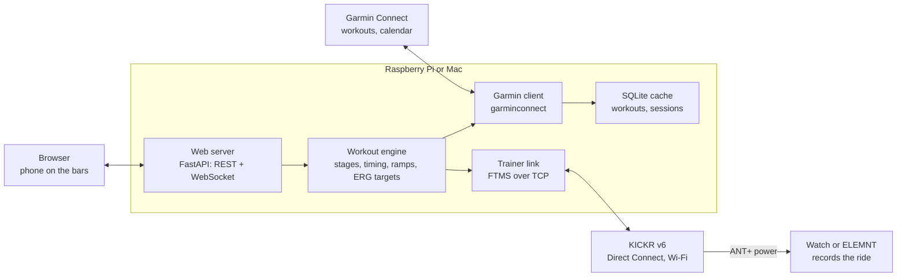
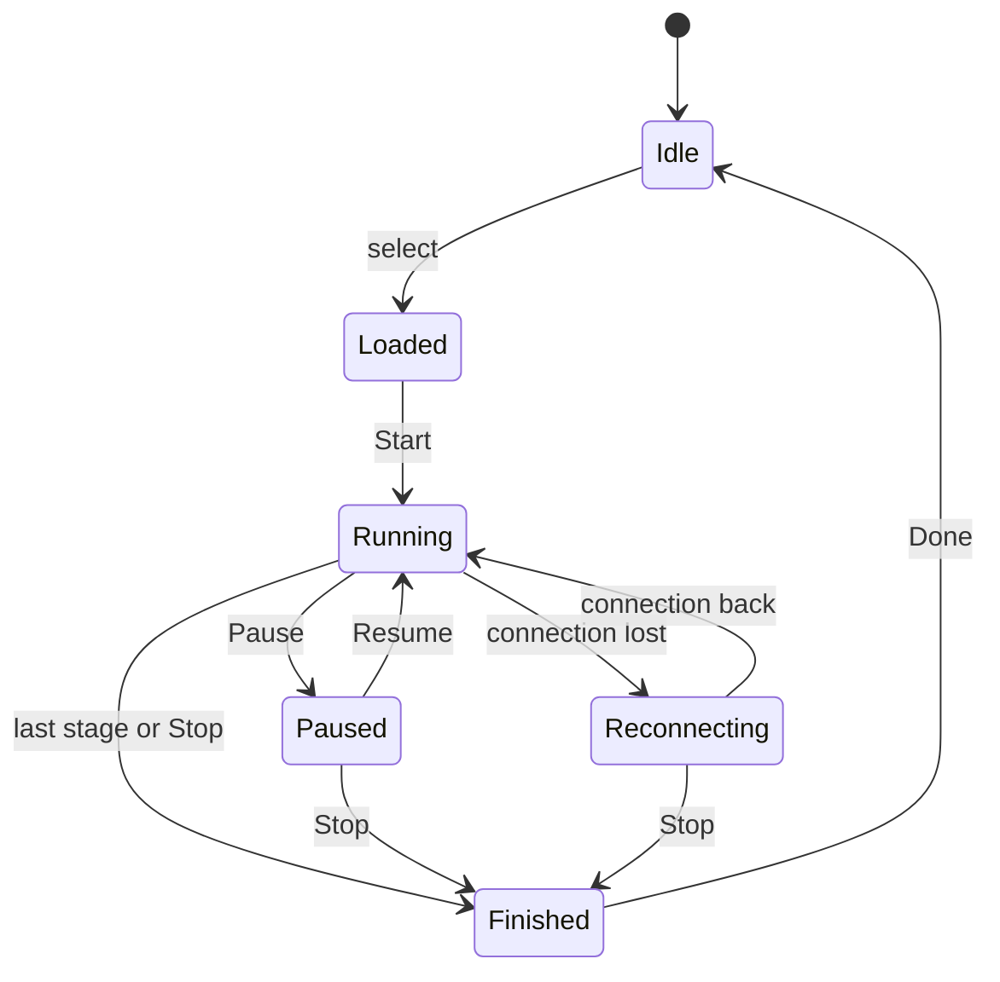

# KICKR Pi Trainer – Software Specification

Version: 2026-09-30 · Author: Attila

> Spec for Cursor. Build in the milestone order of section 12. Target platforms: Raspberry Pi and macOS, one codebase.

## 1. Purpose and scope

KICKR Pi Trainer is a self-hosted app on a Raspberry Pi or a Mac that runs Garmin Connect workouts on a Wahoo KICKR v6 over Wi-Fi, with no subscription software. The rider picks a workout (or today's scheduled one) in a browser, starts it, and follows each stage live.

**Goals**

- List workouts from the rider's Garmin Connect library and the workout scheduled for today.
- Run a selected workout in ERG mode on the KICKR v6 over Wi-Fi (Wahoo Direct Connect).
- Show the current stage, target vs. actual power, cadence and time remaining in a web UI usable from a phone on the handlebars.
- Keep the Garmin watch or ELEMNT as the recording device, so training load and history stay in Garmin Connect.

**Non-goals (v1)**

- No virtual worlds, maps or video.
- No multi-user support; one rider, one trainer.
- No workout editor; workouts are built in Garmin Connect.
- No upload of activities to Garmin (the watch records the ride).

## 2. User stories and main flow

The core flow takes four taps from opening the page to riding: open, pick, start, ride.

**User stories**

- As a rider, I open the web UI on my phone and see today's scheduled Garmin workout at the top, so I can start it with one tap.
- As a rider, I can browse my Garmin workout library and pick any cycling workout instead.
- As a rider, I see a preview of the workout (stages, durations, targets in watts, total time) before starting.
- As a rider, I see the trainer connection state and cannot start until the KICKR is connected.
- As a rider, I follow the current stage live: target power, actual power, cadence, stage time left, total time left, and the next stage.
- As a rider, I can pause, resume, skip a stage, go back a stage, adjust intensity by ±5 %, or stop.
- As a rider, I can set my FTP so % FTP targets are converted to watts.

**Main flow**

1. Rider powers on the KICKR and the host (Pi or Mac); the host discovers the KICKR on the LAN.
2. Rider opens `http://kickr-pi.local` (Pi) or `http://<mac-name>.local:8080` (Mac) on phone or laptop.
3. Home screen shows **Today's workout** (from the Garmin calendar) and the **Library**.
4. Rider selects a workout and sees the preview (profile chart + stage list).
5. Rider taps **Start**; the app takes FTMS control of the KICKR and sets the first target.
6. The workout screen follows stages live; the engine sends a new target at every stage change.
7. At the end, the app releases ERG (or holds a cool-down power) and shows a short summary.
8. Rider stops recording on the watch/ELEMNT, which syncs to Garmin Connect as usual.

## 3. System architecture

One Python process on the host holds the workout engine; the browser is a thin client, so a phone going to sleep never interrupts the ride.



The engine is the only component that sends trainer commands; the watch or ELEMNT only listens to the KICKR's ANT+ power broadcast.

| Layer | Choice |
| --- | --- |
| Language | Python 3.11+, `asyncio` throughout |
| Web | FastAPI + Uvicorn, WebSocket for live data |
| Frontend | Single-page app (Svelte or plain HTML + htmx), built to static files served by FastAPI |
| Garmin | `python-garminconnect` / `garth` |
| Trainer | Own Direct Connect client on `asyncio` streams; `zeroconf` for mDNS; `bleak` as BLE fallback |
| Storage | SQLite via `sqlite3` or SQLModel |
| Service | `systemd` unit on the Pi, `launchd` agent on macOS |

## 4. Functional requirements

The v1 must-haves are Garmin fetch, workout selection, ERG control over Wi-Fi and the live stage view; everything else can follow.

| ID | Requirement | Priority |
| --- | --- | --- |
| FR-01 | Authenticate to Garmin Connect once and persist session tokens on the host | Must |
| FR-02 | Fetch today's scheduled workout(s) from the Garmin calendar | Must |
| FR-03 | List cycling workouts from the Garmin workout library, with name, duration and sport type | Must |
| FR-04 | Parse a Garmin workout into a flat list of stages, expanding repeat blocks | Must |
| FR-05 | Convert targets (watts, % FTP, power zone) into target watts using the configured FTP | Must |
| FR-06 | Show a workout preview: power profile and stage list | Must |
| FR-07 | Discover the KICKR v6 on the LAN via mDNS and connect over Wahoo Direct Connect (TCP) | Must |
| FR-08 | Take FTMS control and set target power (ERG) at every stage change | Must |
| FR-09 | Stream live power, cadence and speed from the trainer to the UI at 1 Hz or better | Must |
| FR-10 | Live stage view: current stage, target, actual, time left in stage and in workout, next stage | Must |
| FR-11 | Controls: start, pause, resume, stop | Must |
| FR-12 | Controls: skip stage, previous stage, intensity ±5 % | Should |
| FR-13 | Ramp stages: interpolate target power every second | Should |
| FR-14 | Handle open-ended stages ("lap button press") with a UI button to advance | Should |
| FR-15 | Settings page: FTP, Garmin login, trainer selection, ERG behaviour | Must |
| FR-16 | Cache fetched workouts locally so the library works offline | Should |
| FR-17 | Auto-reconnect to the trainer and resume the current target after a drop | Must |
| FR-18 | Post-workout summary: duration, average power, time in each stage | Could |
| FR-19 | Local ride log (JSON/FIT) as a backup to the watch recording | Could |
| FR-20 | Read heart rate from a BLE strap or watch HR broadcast and show it | Could |

Cadence- and heart-rate-based targets from Garmin workouts are shown as guidance only; the trainer runs those stages in resistance mode rather than ERG.

## 5. Garmin integration

Workouts come from Garmin Connect through the unofficial `python-garminconnect` library (built on `garth`), because Garmin offers no official API for individual users. The integration sits behind a `WorkoutSource` interface so an intervals.icu source can replace it if Garmin access breaks.

**Authentication**

- First login in the settings page with Garmin email and password; MFA code supported.
- Only the OAuth tokens are stored (in `~/.kickr-pi/garth/`, file mode 600); the password is never persisted.
- Tokens are refreshed automatically; on failure the UI shows a "re-login" banner.

**Data retrieved**

- Today's workout: Garmin calendar for the current month, filtered to today's date and to scheduled workouts with sport type cycling.
- Library: the workout list, filtered to cycling.
- Workout detail: the workout JSON with its segments and steps.

**Parsing rules**

1. Walk the step tree; expand repeat groups N times into a flat stage list.
2. Map each step to a stage: type (warm-up, interval, recovery, rest, cool-down), duration, target.
3. Duration types: time → seconds; "lap button" → open-ended; distance → converted using a default speed and flagged as approximate.
4. Target types: power in watts → as-is; % FTP → FTP × %; power zone → middle of the zone from the rider's Garmin power zones; range → midpoint; no target → free ride (resistance mode).
5. Keep the original step description text to show in the UI.

**Caching and refresh**

- Library and today's workout are fetched on page load, at most every 10 minutes, and on manual refresh.
- The last successful result is cached in SQLite so the UI works when Garmin is unreachable.

Garmin Coach plans and "daily suggested workouts" must be verified early: calendar-scheduled workouts are exposed reliably, suggested workouts may not be.

## 6. KICKR v6 Wi-Fi interface (Wahoo Direct Connect)

The host talks to the KICKR v6 over its built-in 2.4 GHz Wi-Fi using Wahoo Direct Connect, which tunnels standard Bluetooth GATT operations over TCP. The same `TrainerLink` interface also gets a BLE implementation (`bleak`) as a fallback.

**Discovery and connection**

- Browse mDNS for `_wahoo-fitness-tnp._tcp` (python `zeroconf`); take host, port (commonly reported as 36866) and serial from the record.
- Open one TCP connection; Direct Connect is effectively 1:1, so no other app may be connected.
- Discover services and characteristics, then enable notifications on the ones below.
- Allow a manual IP/port override in settings for networks where mDNS is blocked.

**Framing** (per public reverse-engineered implementations; verify against the Berg0162/DirCon project)

- 6-byte header: protocol version, message type, sequence number, response code, payload length (2 bytes, big-endian), then payload.
- Message types used: discover services, discover characteristics, read, write, enable notifications, and unsolicited notification from the trainer.
- UUIDs travel as 16-byte values; characteristic values are the raw BLE payloads.

**FTMS usage**

| Characteristic | UUID | Use |
| --- | --- | --- |
| Fitness Machine Control Point | 0x2AD9 | Write commands, receive indicated responses |
| Indoor Bike Data | 0x2AD2 | Notifications: speed, cadence, power |
| Fitness Machine Status | 0x2ADA | Notifications: control lost, target changed, paused |
| Supported Power Range | 0x2AD8 | Read once: min/max/increment for target clamping |
| Cycling Power Measurement | 0x2A63 | Optional fallback source for power |

| Control Point command | Opcode | Parameter |
| --- | --- | --- |
| Request control | 0x00 | none |
| Reset | 0x01 | none |
| Set target resistance level | 0x04 | uint8, 0.1 % steps (free-ride stages) |
| Set target power | 0x05 | sint16, watts |
| Start or resume | 0x07 | none |
| Stop or pause | 0x08 | 0x01 stop, 0x02 pause |

**Behaviour rules**

- Every control-point write waits for its response indication (timeout 2 s, 2 retries).
- Target power is clamped to the supported power range and only re-sent when it changes by 1 W or more, plus a keep-alive re-send every 10 s.
- On TCP drop: reconnect with backoff (1, 2, 4, 8 s, then every 10 s), re-request control, re-send the current target; the workout clock pauses automatically if no data arrives for 5 s.
- Watch or ELEMNT pairs to the KICKR only as an ANT+ power meter, so it never competes for control.

## 7. Workout engine

The engine is a state machine with a 1-second tick that owns the workout clock and is the only sender of trainer targets.



The workout clock does not advance in Paused or Reconnecting.

**Tick (every 1 s while Running)**

1. Advance stage elapsed time; if the stage is complete, move to the next stage and emit a stage-change event.
2. Compute the target: fixed watts, or for a ramp the linear interpolation between start and end watts.
3. Apply the intensity factor (100 % ± 5 % steps, range 50–150 %) and clamp to the trainer's power range.
4. Send the target if it changed by 1 W or more, or the keep-alive interval has passed.
5. Publish the live state to the WebSocket and append a sample.

**Stage handling**

- ERG stages: set target power (opcode 0x05).
- Free-ride and cadence/HR-target stages: set resistance level from settings (opcode 0x04); show the Garmin target as guidance.
- Open-ended stages: hold the target until the rider taps **Next**.
- Skip and previous: jump to the start of the target stage and send its target immediately.

**Safety rules**

- If cadence stays at 0 for 3 s in ERG, drop the target to 50 % (configurable) to avoid the ERG "death spiral"; restore it over 10 s once pedalling resumes.
- Pause releases ERG to a low resistance, so the rider can soft-pedal or stop.
- On Stop or Finished, send the stop command and release control.
- Engine state is persisted every 5 s, so a restarted service offers to resume the session.

## 8. Web UI and API

The UI is a single-page app served by the host, designed mobile-first for a phone on the handlebars, with large type and dark mode. Live data flows over one WebSocket; everything else is REST.

**Screens**

| Screen | Content | Actions |
| --- | --- | --- |
| Home | Trainer status chip, Garmin status chip, Today's workout card, library list with search | Refresh, open workout, settings |
| Workout preview | Name, total time, TSS-style estimate, power profile chart, stage list | Start, back |
| Ride | Current stage name and index, target W (large), actual W (large, colour vs. target), cadence, stage countdown, total time left, next stage, profile chart with position marker | Pause/resume, skip, previous, −5 % / +5 %, stop (confirm) |
| Summary | Duration, avg power, per-stage targets vs. averages | Done |
| Settings | FTP, Garmin login/logout, trainer discovery and manual IP, keep-alive and ramp options | Save, test connection |

**Ride screen rules**

- Actual power is shown as a 3-second average; green within ±5 % of target, amber beyond ±10 %.
- A 3-second countdown and a short beep before each stage change.
- The screen keeps itself awake (Wake Lock API) during a ride.
- Reloading the page or opening it on a second device shows the running workout; the engine lives on the host, not in the browser.

**REST API**

| Method | Path | Purpose |
| --- | --- | --- |
| GET | /api/status | Trainer, Garmin and engine state |
| GET | /api/workouts/today | Today's scheduled workout(s) |
| GET | /api/workouts | Library list |
| GET | /api/workouts/{id} | Parsed workout with stages in watts |
| POST | /api/session | Start a workout: `{workoutId}` |
| POST | /api/session/command | `pause`, `resume`, `skip`, `previous`, `stop`, `intensity:+5` |
| GET, PUT | /api/settings | Read and change settings |
| POST | /api/garmin/login | Login with credentials and optional MFA code |
| POST | /api/trainer/discover | Re-run mDNS discovery |

**WebSocket** `/ws/live` pushes one message per second: engine state, stage index, stage time left, total time left, target W, power, cadence, speed, heart rate (optional) and connection flags; plus event messages on stage change, connection change and errors.

## 9. Data model

Four entities cover v1; they are stored in SQLite, with Garmin tokens kept as files.

| Entity | Fields | Notes |
| --- | --- | --- |
| Workout | id, source (garmin), source_id, name, sport, scheduled_date, total_s, stages[], raw_json, fetched_at | Cached copy of a Garmin workout |
| Stage | index, name, kind (warmup, interval, recovery, rest, cooldown, free), duration_s or open_ended, target_mode (erg, ramp, resistance), target_w or [start_w, end_w], resistance_pct, cadence_hint, note | Derived when parsing; stored inside Workout as JSON |
| Session | id, workout_id, started_at, ended_at, state, current_stage, stage_elapsed_s, intensity_pct, samples_file | One ride; survives a restart |
| Settings | ftp_w, power_zones, trainer_host, trainer_port, trainer_serial, keepalive_s, ramp_step_s, erg_zero_cadence_drop | Single row |

Samples (1 Hz: timestamp, target, power, cadence, speed, HR) are appended to a per-session file so a crash loses at most a few seconds.

## 10. Non-functional requirements and deployment

The app must run unattended on a Raspberry Pi and equally on a Mac, from the same codebase, and be ready within a minute of start.

| Area | Requirement |
| --- | --- |
| Hardware | Raspberry Pi 4 (2 GB+) or Pi 5, on the same LAN as the KICKR; Pi 3B+ acceptable for Wi-Fi-only use; or any Mac (Apple silicon or Intel) on the same LAN |
| OS | Raspberry Pi OS Lite 64-bit (Bookworm or later), or macOS 13 Ventura or later |
| Startup | Service ready and trainer discovered within 60 s of start |
| Latency | Target change reaches the trainer within 500 ms of the stage boundary |
| UI refresh | Live values update at 1 Hz; UI usable on a 360 px wide phone |
| Reliability | A 2-hour workout runs without manual intervention; reconnects per section 6 |
| Security | LAN only, no port forwarding; optional PIN for the UI; Garmin tokens file mode 600, password never stored |
| Privacy | No data leaves the host except calls to Garmin Connect |
| Maintainability | Python 3.11+, typed, unit tests for parser and engine, a simulated trainer for development; no Pi-only dependencies (no GPIO), CI runs on Linux ARM64 and macOS |

**Deployment on the Raspberry Pi**

- Install via a single script: creates a virtualenv, installs the package, registers a `systemd` service (`kickr-pi.service`, restart on failure).
- Hostname `kickr-pi`, reachable as `kickr-pi.local` through Avahi.
- App listens on port 80 (or 8080 behind a small reverse proxy).
- Logs go to journald; a download-logs button in settings helps debugging.
- Updates: `git pull` + restart, or a published Python wheel.
- Optional: a Docker image for users who prefer containers (host networking required for mDNS).

**Running on a Mac**

The Mac is a first-class target and the main development machine; all platform differences sit in the install script and config.

| Topic | macOS behaviour |
| --- | --- |
| Install | Python 3.11+ from Homebrew (`brew install python`), then the same package in a virtualenv; `pip install kickr-pi` or `git clone` |
| Start | `kickr-pi` from Terminal, or a `launchd` user agent (`~/Library/LaunchAgents/com.kickr-pi.plist`) to start at login |
| Port | 8080 by default (ports below 1024 need root on macOS) |
| UI address | `http://<mac-name>.local:8080` from the phone, or `http://localhost:8080` on the Mac |
| mDNS | Bonjour is built in; `zeroconf` discovery of the KICKR works without Avahi |
| Permissions | macOS 15+ asks to allow Local Network access for Terminal/Python on first run; this must be allowed or the KICKR is not found. The BLE fallback also needs Bluetooth permission |
| BLE fallback | `bleak` uses CoreBluetooth, which exposes device UUIDs instead of MAC addresses; the settings page stores whichever the platform gives |
| Sleep | The app holds a `caffeinate`-style power assertion while a workout runs, so the Mac does not sleep mid-ride |
| Firewall | If the macOS firewall is on, allow incoming connections for Python so the phone can reach the UI |
| Docker | Not recommended on macOS: Docker Desktop does not pass mDNS through, so run natively |

## 11. Risks and open questions

The two biggest risks are the unofficial Garmin access and the undocumented Direct Connect framing; both are isolated behind interfaces and tested first.

| Risk | Impact | Mitigation |
| --- | --- | --- |
| Garmin changes login or private endpoints | No workouts fetched | Cached library; pin and update `garminconnect`; intervals.icu source as fallback |
| Direct Connect framing differs from reverse-engineered docs | No Wi-Fi control | Validate in milestone 1; BLE `TrainerLink` fallback |
| Another app grabs the trainer | Control lost mid-workout | Detect via Fitness Machine Status, show alert, re-request control |
| KICKR firmware update changes behaviour | Commands rejected | Log firmware version; integration test after updates |
| 2.4 GHz interference | Dropouts | Reconnect logic; wired Direct Connect adapter as hardware option |

**Open questions**

- [ ] Are Garmin daily suggested workouts reachable through the calendar endpoint, or only planned ones?
- [ ] Should cadence-target stages run in resistance mode or at a fixed ERG power?
- [ ] Keep the watch as the only recorder, or also upload a FIT file from the host later?
- [ ] Is a physical button (e.g. a BLE remote) wanted for skip/pause?

## 12. Milestones

1. **Trainer spike:** discover the KICKR via mDNS, open Direct Connect, set a fixed target power, read live power; built and tested on the Mac first, then on the Pi.
2. **Engine with a hard-coded workout:** state machine, stage timing, ramps, reconnect, tested against a simulated trainer.
3. **Garmin fetch and parser:** login, today's workout, library, stage parsing with FTP conversion.
4. **Web UI:** home, preview, ride and settings screens with the WebSocket feed.
5. **Hardening:** systemd/launchd service, install script, 2-hour soak test, logging.
6. **Could-haves:** summary, local ride log, heart rate.

## 13. Notes for the coding agent

- Keep hardware and cloud access behind interfaces (`TrainerLink`, `WorkoutSource`) and provide a `SimulatedTrainer` so everything except milestone 1 can be developed and tested without the KICKR.
- Suggested layout:

```
kickr-pi/
├── pyproject.toml
├── SPEC.md
├── src/kickr_pi/
│   ├── main.py            # FastAPI app, startup, settings
│   ├── api/               # REST routes + WebSocket
│   ├── engine/            # state machine, tick, stage logic
│   ├── trainer/           # TrainerLink, dircon.py, ble.py, simulated.py, ftms.py
│   ├── garmin/            # WorkoutSource, garmin_source.py, parser.py
│   ├── storage/           # SQLite models and repository
│   └── web/               # built frontend (static files)
├── frontend/              # SPA source
├── deploy/                # systemd unit, launchd plist, install scripts
└── tests/                 # parser, engine, FTMS encoding, simulated trainer
```

- Encode/decode FTMS payloads in one pure module (`ftms.py`) with unit tests against known byte sequences.
- Never hard-code platform paths; use `platformdirs` for config and data directories.
- All timing uses a monotonic clock; the engine must be testable with an injectable clock.
